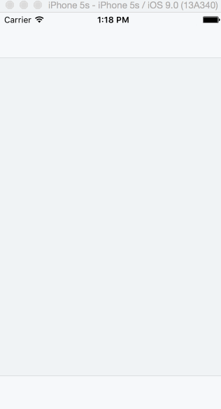

# Dropbox 

This is a prototype of a Dropbox log in and create account flow. 

Time spent: ~10-12 hours to complete

Completed user stories:

 * [x] Required: User can tap through the 3 welcome screens
 * [x] Required: User can follow the create user flow, including
- Tap the back button to the sign in / create account screen
- Read the terms and conditions before creating an account
- After creating an account, a user can view placeholder screens (Files, Photos, Favorites, Settings)
- User can log out from the settings screen
 * [x] Required: User can follow the sign in flow
- Required: User can tap the area for the "having trouble signing in"
- User can log out from the Settings screen
 
Notes:

Walkthrough of all user stories:

GIF created with [LiceCap](http://www.cockos.com/licecap/).

